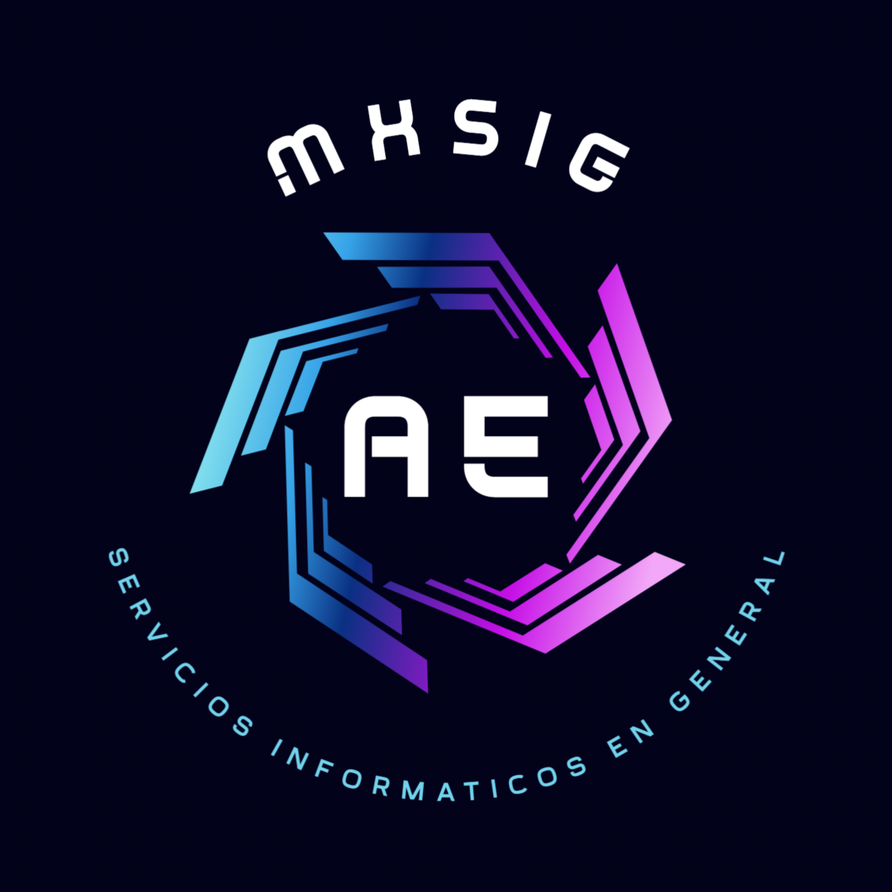

# Actualizador de IP

Sistema de monitoreo que verifica cada 10 minutos si la ip publica cambio y actualiza los DNS de los sub dominios cn cpanel visitando la direccion otorgada y al actualizarlo envia un mensaje en Telegram con el bot configurado y/o al email.

## Authors

- [@aespiritu](https://www.mxsig.com)

## 🚀 Hola, mi nombre es
I'm Antonio Espiritu...
Soy desarrollador FullStack hace más de 10 años principalmente con PHP, JavaScript y MySQL, hace 5 años en proyectos en diferentes lenguajes como JAVA, NodeJS, Angular (proyectos de autoaprendizaje), Python, PostgreSQL, así también conecte bases de datos en Amazon AWS, tengo experiencia con servidores Linux, así como sus variantes de escritorio, uso de Mac OS y Windows.

